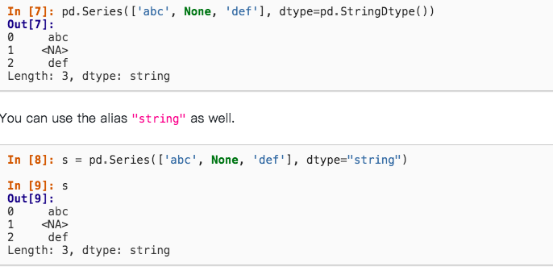
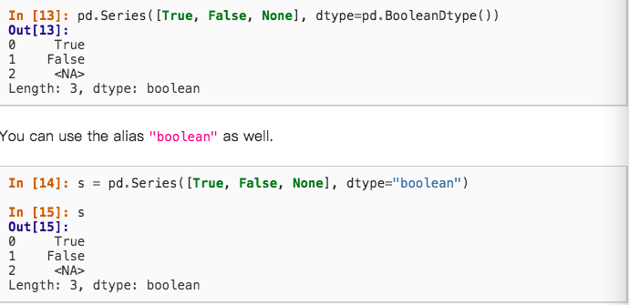
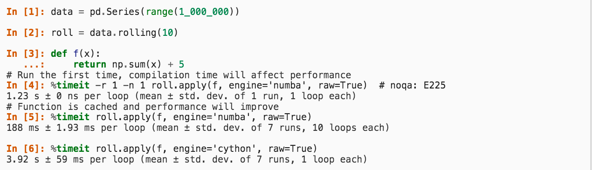
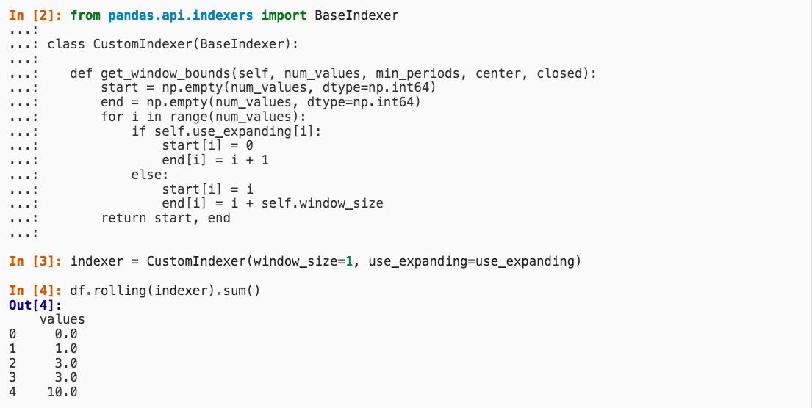
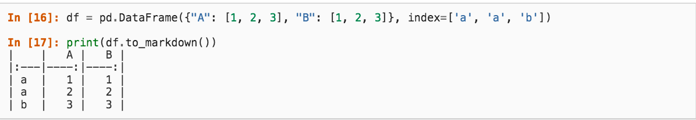

# 1.0.0 Release_note chinese translation
* 背景 : 身為pandas的重度使用者，怎麼能不來了解一下最新版本出了什麼，舊版本哪些東西被丟掉呢?
* [官方文件](https://pandas.pydata.org/pandas-docs/version/1.0.0/whatsnew/v1.0.0.html)
## 新功能們
### pd.NA
* 實驗性質，現在可以使用pd.NA來表示missing value而非np.nan
### String data type
* 之前一直都是使用object，現在可以用pd.StringDtype來表示了!

</img>

* 同時現在也支援更多string操作

### Boolean support with missing

</img>

### apply 現在支援了Numba
* 這使得我們可以更自在的使用apply，向量化也逐漸式微!

</img>
* 第一次需要記憶型別，之後就直接推斷型別了，和cython相比
* 是188ms和將近4秒，速度將近是20倍快

### 自訂Window logic

</img>

### dataframe to markdown

</img>

### Other Enhancements
Other enhancements
DataFrame.to_string() added the max_colwidth parameter to control when wide columns are truncated (GH9784)

Added the na_value argument to Series.to_numpy(), Index.to_numpy() and DataFrame.to_numpy() to control the value used for missing data (GH30322)

MultiIndex.from_product() infers level names from inputs if not explicitly provided (GH27292)

DataFrame.to_latex() now accepts caption and label arguments (GH25436)

The integer dtype with support for missing values and the new string dtype can now be converted to pyarrow (>= 0.15.0), which means that it is supported in writing to the Parquet file format when using the pyarrow engine. It is currently not yet supported when converting back to pandas, so it will become an integer or float (depending on the presence of missing data) or object dtype column. (GH28368)

DataFrame.to_json() now accepts an indent integer argument to enable pretty printing of JSON output (GH12004)

read_stata() can read Stata 119 dta files. (GH28250)

Implemented pandas.core.window.Window.var() and pandas.core.window.Window.std() functions (GH26597)

Added encoding argument to DataFrame.to_string() for non-ascii text (GH28766)

Added encoding argument to DataFrame.to_html() for non-ascii text (GH28663)

Styler.background_gradient() now accepts vmin and vmax arguments (GH12145)

Styler.format() added the na_rep parameter to help format the missing values (GH21527, GH28358)

Roundtripping DataFrames with nullable integer, string and period data types to parquet (to_parquet() / read_parquet()) using the ‘pyarrow’ engine now preserve those data types with pyarrow >= 0.16.0 (GH20612, GH28371).

The partition_cols argument in DataFrame.to_parquet() now accepts a string (GH27117)

pandas.read_json() now parses NaN, Infinity and -Infinity (GH12213)

The pandas.np submodule is now deprecated. Import numpy directly instead (GH30296)

to_parquet() now appropriately handles the schema argument for user defined schemas in the pyarrow engine. (GH30270)

DataFrame constructor preserve ExtensionArray dtype with ExtensionArray (GH11363)

DataFrame.sort_values() and Series.sort_values() have gained ignore_index keyword to be able to reset index after sorting (GH30114)

DataFrame.sort_index() and Series.sort_index() have gained ignore_index keyword to reset index (GH30114)

DataFrame.drop_duplicates() has gained ignore_index keyword to reset index (GH30114)

Added new writer for exporting Stata dta files in version 118, StataWriter118. This format supports exporting strings containing Unicode characters (GH23573)

Series.map() now accepts collections.abc.Mapping subclasses as a mapper (GH29733)

The pandas.datetime class is now deprecated. Import from datetime instead (GH30296)

Added an experimental attrs for storing global metadata about a dataset (GH29062)

Timestamp.fromisocalendar() is now compatible with python 3.8 and above (GH28115)

DataFrame.to_pickle() and read_pickle() now accept URL (GH30163)

### 注意！ 你要噴Error了!

### `MultiIndex.level`

### `DataFrame.rename`

### `df.info(verbose=True)`

### Python3.6.1